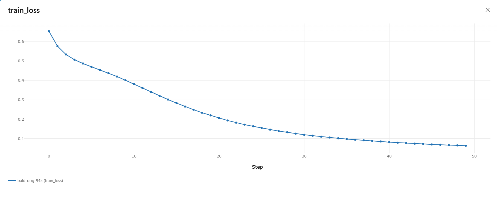
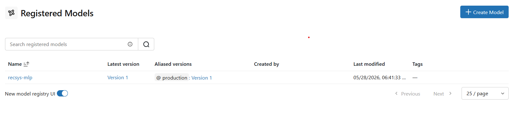
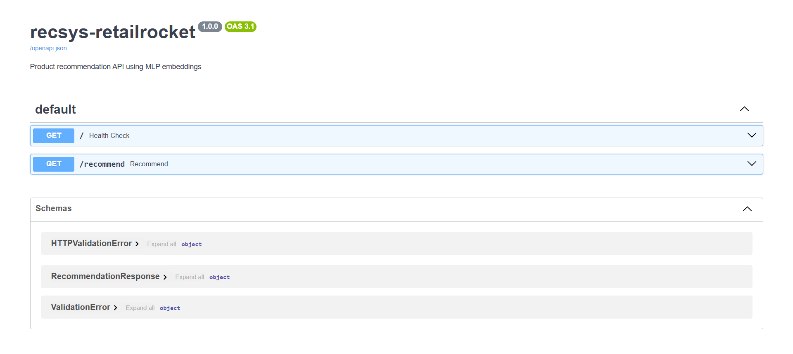

# recsys-retailrocket


A product recommendation system for e-commerce based on user browsing behavior, using an MLP with PyTorch embeddings.

## Architecture

- **preprocess** — filters and encodes RetailRocket events
- **feature_eng** — builds sparse interaction matrix with event weights  
- **train** — trains MLP with embeddings and logs to MLflow
- **evaluate** — computes Precision, Recall, NDCG and Hit Rate @10

## Stack

- **Model:** MLP with user and item embeddings (PyTorch)
- **Pipeline:** DVC with 4 reproducible stages
- **Experiments:** MLflow tracking + Model Registry
- **Containerization:** Multi-stage Docker + docker-compose
- **Code quality:** ruff, pre-commit hooks, semantic commits
- **Configuration:** Pydantic Settings + .env

## Project Structure

```
recsys-retailrocket/
├── src/recsys/
│   ├── config/        # Pydantic Settings
│   ├── data/          # Preprocessing
│   ├── features/      # Feature engineering
│   ├── models/        # MLP, baseline, Factory Pattern
│   └── evaluation/    # Metrics
├── configs/           # YAML configuration files
├── scripts/           # Utilities and model registration
├── tests/             # Automated tests
├── docs/              # Model Card
├── notebooks/         # EDA and exploration
├── data/              # DVC-tracked data
├── models/            # Trained models
├── metrics/           # Experiment metrics
├── dvc.yaml           # Reproducible pipeline
├── docker-compose.yml # Containerized services
└── Dockerfile         # Multi-stage build
```

## Quick Start

### Prerequisites

- Python 3.10+
- Poetry 2.4+
- Docker Desktop
- CUDA 12.1 (optional, for GPU)

### Installation

```bash
git clone https://github.com/GFurts/recsys-retailrocket.git
cd recsys-retailrocket
poetry install
cp .env.example .env
```

### PyTorch with CUDA (optional)

```bash
poetry run pip install torch==2.5.1+cu121 \
  --index-url https://download.pytorch.org/whl/cu121 \
  --force-reinstall
```

### Validate environment

```bash
poetry run python scripts/validate_env.py
```

### Reproduce pipeline

```bash
# Download data
poetry run dvc pull

# Run full pipeline
poetry run dvc repro
```

### Start MLflow server

```bash
poetry run mlflow server --host 127.0.0.1 --port 5000
```

### Register model

```bash
poetry run python scripts/register_model.py
```

### Compare models

```bash
poetry run python scripts/compare_models.py
```

## Screenshots

### Training Loss (MLflow)


### Model Registry


### Live API (Swagger UI)


## Live Demo

- **Swagger UI:** https://recsys-retailrocket.onrender.com/docs
- **Health check:** https://recsys-retailrocket.onrender.com
- **Recommendations:** https://recsys-retailrocket.onrender.com/recommend?user_id=0&top_k=10

> Free tier — first request may take ~30s to wake up.

## Results

| Metric | Baseline | MLP |
|---|---|---|
| Precision\@10 | 0.0046 | 0.0014 |
| Recall\@10 | 0.0053 | 0.0044 |
| NDCG\@10 | 0.0063 | 0.0028 |
| Hit Rate\@10 | 0.0254 | 0.0138 |

## Dataset

[RetailRocket E-commerce Dataset](https://www.kaggle.com/datasets/retailrocket/ecommerce-dataset)
— 2.7M browsing events, 80K users, 39K items.

## Documentation

- [Model Card](docs/model_card.md)

## Author

Gabriel Furtado — [LinkedIn](https://linkedin.com/in/gabriel-furtado30) · [GitHub](https://github.com/GFurts)